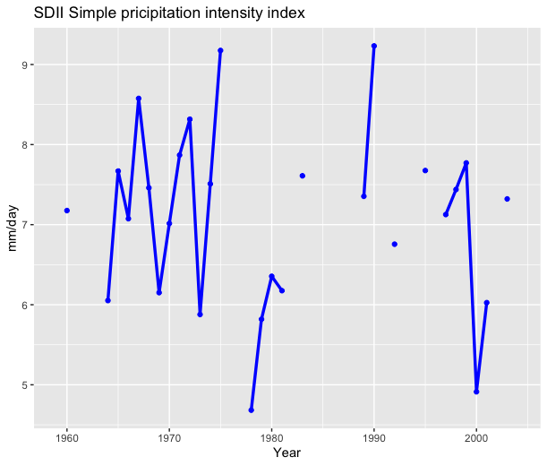

## The Package

The climdex.pcic package provides an implementation of the 27 core climate change indices of the ETCCDI.

Climdex.pcic is not available from CRAN at this time.
To install the package I used the following commands:


```{r, eval=F}
install.packages('PCICt')
install.packages('https://pacificclimate.org/R/climdex.pcic_1.1-11.tar.gz')
library(climdex.pcic)
``` 


## Parse the dates into PCICt

Create a climdexInput object from some data already loaded in and ready to go.


```{r, eval=F}
tmax.dates <- as.PCICt(do.call(paste, ec.1018935.tmax[,c("year",
                                                         "jday")]), format="%Y %j", cal="gregorian")
tmin.dates <- as.PCICt(do.call(paste, ec.1018935.tmin[,c("year",
                                                         "jday")]), format="%Y %j", cal="gregorian")
prec.dates <- as.PCICt(do.call(paste, ec.1018935.prec[,c("year",
                                                         "jday")]), format="%Y %j", cal="gregorian")
``` 

Load the data in


```{r, eval=F} 
ci <- climdexInput.raw(ec.1018935.tmax$MAX_TEMP,
                       ec.1018935.tmin$MIN_TEMP, ec.1018935.prec$ONE_DAY_PRECIPITATION,
                       tmax.dates, tmin.dates, prec.dates, base.range=c(1971, 2000))
``` 


## Compute the indeces

I divided indices into different categories, which can be represented with the same graphs. 

## Indices based on absolute thresholds
### 1. Frost days, FD index

Annual count of days where daily minimum temperature drops below 0 degrees Celsius

```{r, eval=F} 
fd <- climdex.fd(ci)
df_fd <- data.frame(
  year = as.numeric(names(fd)),
  value = as.numeric(fd)
)
```
```
summary(fd)
#Output:
 Min. 1st Qu.  Median    Mean 3rd Qu.    Max.    NA's 
   0.00    7.50   13.00   13.88   19.00   44.00      14 
```
```{r, eval=T} 
library(ggplot2)
ggplot(df_fd, aes(x = factor(year), y = value)) +
  geom_bar(stat = "identity", fill = "green") +
  labs(
    title = "FD: frost days, days where min T < 0",
    x = "Anno",
    y = "Days"
  )
```


### 2. Summer days, SU index

Annual count of days where daily maximum temperature exceeds 25 degrees Celsius
```
su <- climdex.su(ci)
summary(su)
#Output:
Min. 1st Qu.  Median    Mean 3rd Qu.    Max.    NA's 
  1.000   3.750   5.000   6.062   8.000  15.000      14 
```


### 3. Icing days, ID index

Annual count of days where daily maximum temperature is below 0 degrees Celsius
```
id <- climdex.id(ci)
summary(id)
#Output:
Min. 1st Qu.  Median    Mean 3rd Qu.    Max.    NA's 
  0.000   0.000   0.000   1.812   3.250  10.000      14 
```


### 4. Tropical nights, TR index

Annual count of days where daily minimum temperature stays above 20 degrees Celsius
```
tr <- climdex.tr(ci)
summary(tr)
#Output:
Min. 1st Qu.  Median    Mean 3rd Qu.    Max.    NA's 
      0       0       0       0       0       0      14 
```
## Indices derived from combined temperature/precipitation
### 5. Growing season length, GSL index

The number of days between the start of the first spell of warm days in the first half of the year, 
and the start of the first spell of cold days in the second half of the year.
Spells of warm days: six or more days with mean temperature above 5 degrees Celsius.
Spells of cold days: six or more days with a mean temperature below 5 degrees Celsius.
There are 3 modes for test purpose only:
- ’GSL_first’ returns the first growing season found; 
- ’GSL_max’ returns the longest growing season found;  
- ’GSL_sum’ returns the total length of all growing seasons found.
```
gsl <- climdex.gsl(ci)
a <- climdex.gsl(ci, gsl.mode = c("GSL", "GSL_first", "GSL_max", "GSL_sum"))

b <- growing.season.length(ci@data$tavg, ci@date.factors$annual, ci@dates,
                           ci@northern.hemisphere, gsl.mode="GSL") *
  ci@namasks$annual$tavg
```
```
summary(gsl)
# Output
Min. 1st Qu.  Median    Mean 3rd Qu.    Max.    NA's 
  269.0   313.8   329.5   324.9   341.8   362.0      14
```


### 16. DTR, Daily temperature range: Monthly mean difference between TX and TN

This function computes the diurnal temperature range on a monthly basis.
```
dtr <- climdex.dtr(ci, freq = c("annual"))
summary(dtr)
#Output:
Min. 1st Qu.  Median    Mean 3rd Qu.    Max.    NA's 
  5.945   6.330   6.806   6.818   7.093   8.260      14 
```
This index has been included in this section because it belongs to this category, despite the order.

## Extreme heat and cold indices
### 6. Monthly maximum of daily maximum temperature, TXx index 

Computes the monthly or annual maximum of daily maximum temperature.

In this case, I decided to compute only annual data for simplicity. To enter monthly data, simply indicate ‘monthly’ in brackets in the frequency field.
```
txx <- climdex.txx(ci, freq = c("annual"))
summary(txx)
#Output:
Min. 1st Qu.  Median    Mean 3rd Qu.    Max.    NA's 
   8.00   13.00   17.80   18.36   23.35   31.10      40 
```


### 7. Monthly maximum of daily minimum temperature, TNx index:

Computes the monthly or annual maximum of daily minimum temperature
```
tnx <- climdex.tnx(ci, freq = c("annual"))
summary(tnx)
#Output:
Min. 1st Qu.  Median    Mean 3rd Qu.    Max.    NA's 
  12.20   13.45   14.50   14.53   15.12   17.50      14
```


### 8. Monthly minimum of daily maximum temperature, TXn index:
Computes the monthly or annual minimum of daily maximum temperature
```
txn <- climdex.txn(ci, freq = c("annual"))
summary(txn)
#Output:
Min. 1st Qu.  Median    Mean 3rd Qu.    Max.    NA's 
-9.4000 -2.9750  0.2500 -0.7312  2.2000  5.0000      14 
```


### 9. Monthly minimum value of daily minimum temperature, TNn index:
Computes the monthly or annual minimum of daily minimum temperature
```
tnn <- climdex.tnn(ci, freq = c("annual"))
summary(tnn)
#Output:
Min. 1st Qu.  Median    Mean 3rd Qu.    Max.    NA's 
-13.900  -7.700  -4.750  -5.172  -3.175   0.000      14
```


## Temperature indices based on percentile thresholds (anomalies relative to climate)

### 10. Percentage of days when TN < 10th percentile, TN10p index:

Computation of these values outside of the base period involves comparing the temperature data for
each day with the corresponding percentiles for a 5-day running window surrounding that day. The
resulting monthly series is then the monthly percentage of values that meet the criteria.
```
tn10p <- climdex.tn10p(ci, freq = c("annual"))
summary(tn10p)
#Output:
Min. 1st Qu.  Median    Mean 3rd Qu.    Max.    NA's 
 0.5479  3.8781  6.9384  9.2091 12.9452 30.9120      14
```


### 11. Percentage of days when TX < 10th percentile, TX10p index:

Computation of these values inside the base period is more complicated. 
It involves comparison of the daily temperature data with the corresponding day of temperature data in each of (n - 1) sets of data. 
The sets consist of the data for the base period, with the current year replaced with each of the other years. 
The results of these comparisons are then averaged to give a value between 0 and 1. 
Finally, the resulting daily series is aggregated to a monthly series by averaging these daily values and multiplying by 100 to give a monthly percentile value.

```
tx10p <- climdex.tx10p(ci, freq = c("annual"))
summary(tx10p)
#Output:
Min. 1st Qu.  Median    Mean 3rd Qu.    Max.    NA's 
  0.000   0.000   6.667  10.321  15.934  64.516      40
```

### 12. Percentage of days when TN > 90th percentile, TN90p index:
Computation of these values outside of the base period involves comparing the temperature data for each day with the corresponding percentiles for a 5-day running window surrounding that day. 
The resulting monthly series is then the monthly percentage of values that meet the criteria.

```
tn90p <- climdex.tn90p(ci, freq = c("annual"))
summary(tn90p)
#Output:
   Min. 1st Qu.  Median    Mean 3rd Qu.    Max.    NA's 
  0.000   0.000   3.571   8.488  12.903  57.620      37
```

### 13. TX90p, Percentage of days when TX > 90th percentile:

```
tx90p <- climdex.tx90p(ci, freq = c("annual"))
summary(tx90p)
#Output:
   Min. 1st Qu.  Median    Mean 3rd Qu.    Max.    NA's 
  0.000   3.115   6.452   9.739  16.129  48.387      40
```

## Duration or frequency indices
### 14. WSDI, Warm spell duration index:
Annual count of days with at least 6 consecutive days when TX > 90th percentile
A "warm spell" is defined as a sequence of 6 or more days in which the daily maximum
temperature exceeds the 90th percentile of daily maximum temperature for a 5-day running window
surrounding this day during the baseline period

```
wsdi <- climdex.wsdi(ci, spells.can.span.years = FALSE)
summary(wsdi)
#Output:
   Min. 1st Qu.  Median    Mean 3rd Qu.    Max.    NA's 
  0.000   0.000   0.000   1.156   0.000  12.000      14
```


### 15. CSDI, Cold spell duration index: 
Annual count of days with at least 6 consecutive days when TN < 10th percentile
A "cold spell" is defined as a sequence of 6 or more days in which the daily minimum temperature is below the 10th percentile of daily minimum temperature for a 5-day running window
surrounding this day during the baseline period.
```
csdi <- climdex.csdi(ci, spells.can.span.years = FALSE)
summary(csdi)
#Output:
   Min. 1st Qu.  Median    Mean 3rd Qu.    Max.    NA's 
  0.000   0.000   0.000   4.438   0.000  71.000      14
```

## Precipitation indices: quantity
### 17. Rx1day, Monthly maximum 1-day precipitation:
Monthly or annual maximum 1-day precipitation
```
rx1day <- climdex.rx1day(ci, freq = c("annual"))
summary(rx1day)
#Output:
   Min. 1st Qu.  Median    Mean 3rd Qu.    Max.    NA's 
  24.90   36.00   48.80   50.62   59.15   91.60      18
```


### 18. Rx5day, Monthly maximum consecutive 5-day precipitation:

```
rx5day <- climdex.rx5day(ci, freq = c( "annual"),
               center.mean.on.last.day = FALSE)
#center.mean.on.last.day --> Whether to center the 5-day running mean on the last day of the window, instead of the center day
```
```
summary(rx1day)
#Output:
   Min. 1st Qu.  Median    Mean 3rd Qu.    Max.    NA's 
  24.90   36.00   48.80   50.62   59.15   91.60      18
```

## Rainfall duration or frequency indices
### 19. SDII Simple precipitation intensity index:
The sum of precipitation in wet days (days with precipitation over 1mm) during the year
divided by the number of wet days in the year.
```
sdii <- climdex.sdii(ci)
summary(sdii)
#Output:
   Min. 1st Qu.  Median    Mean 3rd Qu.    Max.    NA's 
  4.683   6.169   7.249   7.078   7.671   9.232      18
```


### 20. R10mm Annual count of days when PRCP≥ 10mm:
Annual count of days where daily precipitation is more than 10mm per day
```
r10mm <- climdex.r10mm(ci)
summary(r10mm)
#Output:
   Min. 1st Qu.  Median    Mean 3rd Qu.    Max.    NA's 
  15.00   22.00   26.00   27.25   33.00   44.00      18
```

### 21. R20mm Annual count of days when PRCP≥ 20mm:
```
r20mm <- climdex.r20mm(ci)
summary(r20mm)
#Output
   Min. 1st Qu.  Median    Mean 3rd Qu.    Max.    NA's 
  2.000   6.750   8.000   8.179  11.000  14.000      18
```

### 22. Rnnmm Annual count of days when PRCP≥ nnmm:
nn is a user-defined threshold
threshold <-- threshold to be used for Rnnmm
```
rnnmm <- climdex.rnnmm(ci, threshold = 1)
rnnmm2 <- climdex.rnnmm(ci, threshold = 2)
```
```
summary(rnnmm)
#Output:
Min. 1st Qu.  Median    Mean 3rd Qu.    Max.    NA's 
  106.0   114.8   128.5   131.6   147.0   177.0      18

summary(rnnmm2)
#Output:
   Min. 1st Qu.  Median    Mean 3rd Qu.    Max.    NA's 
  84.00   90.75  102.50  103.82  114.25  135.00      18
```

### 23. CDD: Maximum length of dry spell:

```
cdd <- climdex.cdd(ci, spells.can.span.years = TRUE)
cdd2 <- climdex.cdd(ci, spells.can.span.years = FALSE)
# spells.can.span.year <-- specifies whether spells can cross year boundaries or not (true=yes)
```
```
summary(cdd)
#Output:
   Min. 1st Qu.  Median    Mean 3rd Qu.    Max.    NA's 
  15.00   24.00   33.00   33.57   41.25   59.00      18

summary(cdd2)
#Output:
   Min. 1st Qu.  Median    Mean 3rd Qu.    Max.    NA's 
  15.00   24.00   33.00   33.57   41.25   59.00      18
# No differencies
```

### 24. CWD: Maximum length of wet spell:
```
cwd <- climdex.cwd(ci, spells.can.span.years = TRUE)
summary(cwd)
#Output:
   Min. 1st Qu.  Median    Mean 3rd Qu.    Max.    NA's 
   6.00    9.75   12.50   12.54   14.00   27.00      18
```

## Precipitation indices: quantity
### 25. R95pTOT: Annual total PRCP when RR > 95p
The annual sum of precipitation in days where daily precipitation exceeds the 95th percentile of daily precipitation in the base period.
```
r95ptot <- climdex.r95ptot(ci)
summary(r95ptot)
#Output:
   Min. 1st Qu.  Median    Mean 3rd Qu.    Max.    NA's 
   50.8   139.8   218.4   224.0   308.3   423.8      18 
```


### 26. R99pTOT: Annual total PRCP when RR > 99p:
The annual sum of precipitation in days where daily precipitation exceeds the 99th percentile of daily precipitation in the base period.
```
r99ptot <- climdex.r99ptot(ci)
summary(r99ptot)
#Output
   Min. 1st Qu.  Median    Mean 3rd Qu.    Max.    NA's 
   0.00    0.00   51.40   69.42  105.65  282.60      18 
```

### 27. PRCPTOT: Annual total precipitation in wet days
Annual sum of precipitation in wet days (days where precipitation is at least 1mm)
```
prcptot <- climdex.prcptot(ci)
summary(prcptot)
#Output:
   Min. 1st Qu.  Median    Mean 3rd Qu.    Max.    NA's 
  585.4   790.8   910.5   930.9  1083.8  1292.5      18
```
